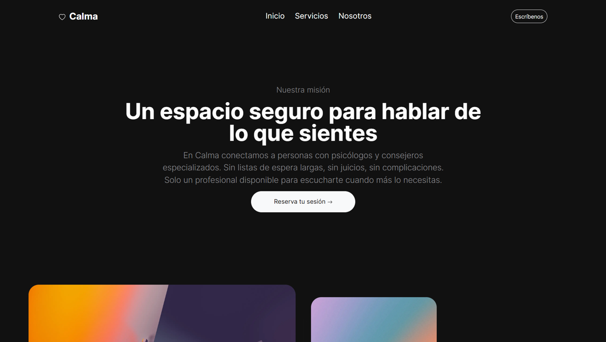
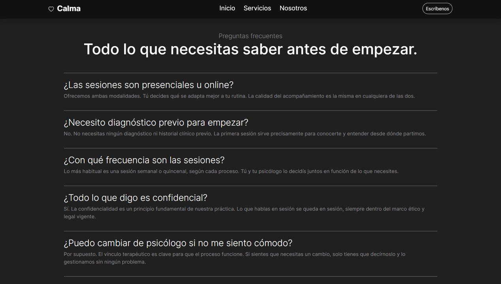
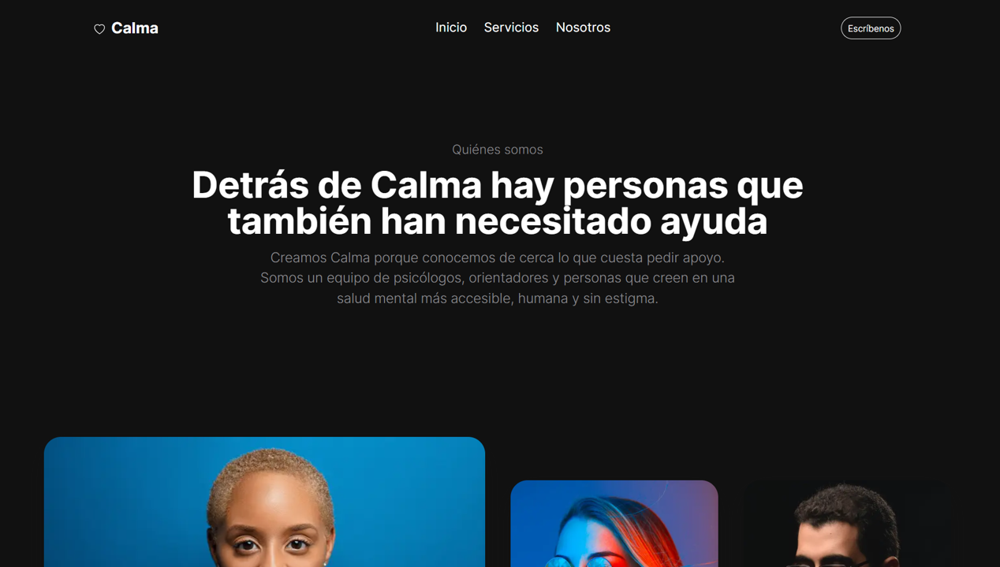

# 🌿 Calma — Emotional Wellness Platform

Bootstrap startup website template based on dark theme · Fictional emotional wellness platform · HTML · Bootstrap 5 · UI/UX

---

## 🖼️ Preview





---

## 🛠️ Tech Stack


- HTML5
- Bootstrap 5
- AOS.js — scroll animations
- Bootstrap Icons

---

## 📄 Pages

| Page | Description |
|------|-------------|
| `index.html` | Home — hero, services overview, team, pricing and testimonials |
| `content.html` | Services — full services list, FAQ and pricing |
| `system.html` | About us — story, founder, team and values |

---

## 🚀 Getting Started

```bash
git clone https://github.com/yxdhii/calma-website.git
```

Just open `index.html` in your browser. No install needed.

---

## 📝 Credits

- Base template: [Klar by TemplateDeck](https://templatedeck.com/templates/klar)
- Concept, content and adaptation: Yadhira Saavedra

---

## 📌 Status

🚧 In progress

- [x] Home page
- [x] Services page
- [x] About us page
- [ ] Contact form
- [ ] Deploy to GitHub Pages